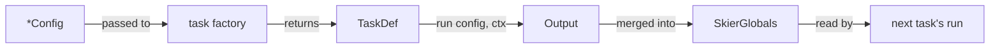

# API Reference

Skier's programmatic surface — the types you import and the contract you
implement when you write `skier.tasks.mjs` or author a custom task. Everything
documented here is exported from the package root:

```ts
import {
  // built-in task factories
  prepareOutputTask,
  generateItemsTask,
  // …and their config + output types
} from 'skier';

import type {
  TaskDef,
  TaskContext,
  Logger,
  SkierItem,
  SkierGlobals,
} from 'skier';
```

Every code block in this section is **transcluded from the real source at build
time** (via [`@include`](../markdown-frontmatter.md#snippet-transclusion-include)),
so the signatures here are always exactly what the package ships — they cannot
drift.

---

## What's here

| Page | Covers |
|------|--------|
| [Task Contract](./task-contract.md) | `TaskDef`, `TaskContext`, `Logger` — the shape every task implements and the config-in / globals-out contract `run()` follows. This is the custom-task authoring API. |
| [Core Types](./core-types.md) | `SkierItem` and `SkierGlobals` (the data that flows through a pipeline), plus the structured data built-in tasks produce: `NavData`, `PaginationMeta`, `SearchIndex`. |
| [Config Interfaces](./config-interfaces.md) | The exported `*Config` type for every built-in task, in one place, each linking to its full [Task Reference](../task-reference/index.md) page. |

---

## How the pieces fit



A **task factory** (e.g. `generateItemsTask`) takes a `*Config` object and
returns a [`TaskDef`](./task-contract.md#taskdef). Skier runs each `TaskDef`'s
[`run()`](./task-contract.md#the-run-contract) in order, passing the config and a
shared [`TaskContext`](./task-contract.md#taskcontext); whatever `run()` returns
is merged into [`SkierGlobals`](./core-types.md#skierglobals) for later tasks and
templates to read.

---

## Related

- [Custom Tasks](../custom-tasks.md) — the how-to guide for writing tasks (this
  section is the reference for the types that guide uses).
- [Task Reference](../task-reference/index.md) — per-task usage, options, and
  examples for every built-in.
- [Architecture](../architecture.md) — the end-to-end pipeline model.
