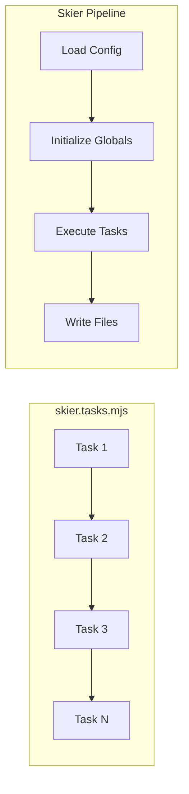
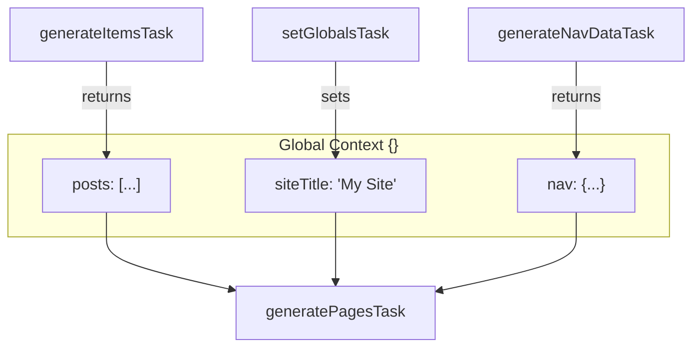
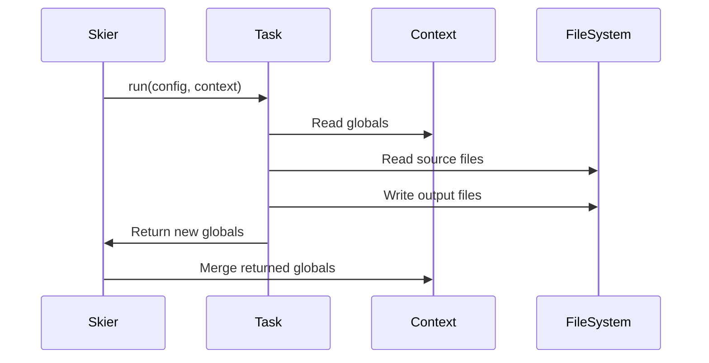

# Architecture

This guide explains how Skier works under the hood—its pipeline model, data flow, and execution lifecycle.

---

## Pipeline Model

Skier uses a **sequential task pipeline**. Each task runs in order, with the output of one task available to all subsequent tasks via the global context.



---

## Data Flow

The **global context** is the central data store. Tasks read from and write to this shared object:



**Key principle**: Tasks that *produce* data should come before tasks that *consume* it.

---

## Task Execution Lifecycle

Every task follows the same execution pattern:



1. **Skier** calls `task.run(config, context)`
2. **Task** reads from `context.globals` and source files
3. **Task** writes output files
4. **Task** returns an object (new globals to merge)
5. **Skier** merges returned object onto `context.globals`

---

## Typical Project Structure

```
my-site/
├── src/
│   ├── pages/           # Page templates (Handlebars)
│   ├── partials/        # Shared template fragments
│   ├── items/           # Content items (Markdown/JSON)
│   │   └── posts/       # Blog posts collection
│   ├── styles/          # CSS source files
│   └── static/          # Static assets (images, fonts)
├── public/              # Generated output (don't edit!)
├── skier.tasks.mjs      # Pipeline configuration
└── package.json
```

---

## Task Categories

Tasks fall into four categories, typically ordered in this sequence:

| Category | Purpose | Example Tasks |
|----------|---------|---------------|
| **Setup** | Prepare directories, set config | `prepareOutputTask`, `setGlobalsTask` |
| **Content** | Process items, generate pages | `generateItemsTask`, `generatePagesTask` |
| **Feeds** | Create syndication/discovery files | `generateFeedTask`, `generateSitemapTask` |
| **Assets** | Bundle CSS, copy static files | `bundleCssTask`, `copyStaticTask` |

---

## Execution Order Example

A typical pipeline for a blog:

```js
// skier.tasks.mjs
export default [
  // 1. Setup
  prepareOutputTask({ outDir: 'public' }),
  setGlobalsTask({ values: { siteTitle: 'My Blog' } }),

  // 2. Content (order matters!)
  generateItemsTask({
    itemsDir: 'src/items/posts',
    outputVar: 'posts',  // → globals.posts
    // ...
  }),

  // 3. Pages (uses globals.posts)
  generatePagesTask({
    pagesDir: 'src/pages',
    // ...
  }),

  // 4. Feeds (uses globals.posts)
  generateFeedTask({
    articles: '${posts}',  // Reference the global
    // ...
  }),

  // 5. Assets
  bundleCssTask({ from: 'src/styles', to: 'public' }),
  copyStaticTask({ from: 'src/static', to: 'public' }),
];
```

---

## Debug Mode

Run with `--debug` to see detailed execution logs:

```bash
npx skier --debug
```

This shows:
- Task start/end times
- Globals at each step
- File operations

---

**Next:** See [Recipes](./recipes.md) for complete project examples, or [Custom Tasks](./custom-tasks.md) to extend the pipeline.
