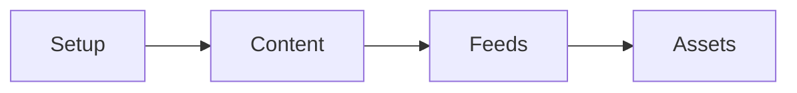
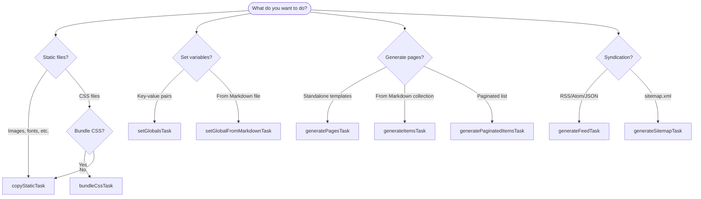

# Built-In Tasks

Skier includes tasks for all common static site needs. Use them as building blocks for your pipeline.

---

## Task Categories

Organize your pipeline in this order:



| Category | Tasks | Purpose |
|----------|-------|---------|
| **Setup** | `prepareOutputTask`, `setGlobalsTask`, `setGlobalFromMarkdownTask` | Initialize directories and shared data |
| **Content** | `generateItemsTask`, `generatePaginatedItemsTask`, `generatePagesTask` | Process and render content |
| **Feeds** | `generateFeedTask`, `generateSitemapTask` | Create discovery/syndication files |
| **Assets** | `bundleCssTask`, `copyStaticTask` | Optimize and copy static files |

---

## Which Task Do I Need?



---

## Task Reference

### Setup Tasks

| Task | Description |
|------|-------------|
| [prepareOutputTask](./prepareOutputTask.md) | Create/clean the output directory |
| [setGlobalsTask](./setGlobalsTask.md) | Set site-wide variables |
| [setGlobalFromMarkdownTask](./setGlobalFromMarkdownTask.md) | Set globals from Markdown content |

### Content Tasks

| Task | Description |
|------|-------------|
| [generatePagesTask](./generatePagesTask.md) | Render standalone page templates |
| [generateItemsTask](./generateItemsTask.md) | Generate pages from Markdown collections |
| [generatePaginatedItemsTask](./generatePaginatedItemsTask.md) | Create paginated list pages |

### Feed Tasks

| Task | Description |
|------|-------------|
| [generateFeedTask](./generateFeedTask.md) | Create RSS, Atom, and JSON feeds |
| [generateSitemapTask](./generateSitemapTask.md) | Generate sitemap.xml |

### Asset Tasks

| Task | Description |
|------|-------------|
| [bundleCssTask](./bundleCssTask.md) | Bundle and minify CSS |
| [copyStaticTask](./copyStaticTask.md) | Copy static files unchanged |

---

## Minimal Pipeline Example

```js
// skier.tasks.mjs
import {
  prepareOutputTask,
  setGlobalsTask,
  generatePagesTask,
  copyStaticTask,
} from 'skier';

export default [
  prepareOutputTask({ outDir: 'public' }),
  setGlobalsTask({ values: { siteTitle: 'My Site' } }),
  generatePagesTask({
    pagesDir: 'src/pages',
    partialsDir: 'src/partials',
    outDir: 'public',
  }),
  copyStaticTask({ from: 'src/static', to: 'public' }),
];
```

---

**Next:** See [Recipes](../recipes.md) for complete project examples.
